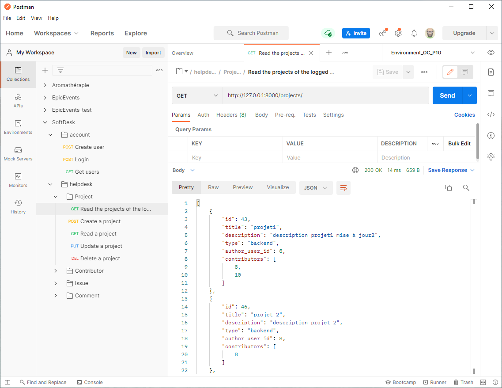

# SoftDesk v1
**_Projet réalisé lors de ma formation de Développeur d'application Python à OpenClassrooms_**

_**SoftDesk is a Back-end efficient and secure RESTful API to manage:**_
* Projetcts
* Issues (incidents)
* Users / Contributors
* Comments

_**The API SoftDesk uses:**_
* Django
* Django Rest
* Postman

_**The API SoftDesk has two applications coded in Python with DjangoRest:**_
1. account
1. helpdesk

_**The data are saved in the database db.sqlite3**_

## Installation
* At lest Python 3.9.1 must be installed.
* Download the package application from github, unzip it and store it in a new directory.
* Open a  new windows 10 terminal in this directory with the command `cmd`.
* Create a virtual environnement `python -m venv env`
* Activate the virtual environnement `env\Scripts\activate.bat`
* Install the last version of pip `python -m pip install --upgrade pip`
* Install the external Python packages with `pip install -r requirements.txt`

## Use
* Activate the virtual environnement `env\Scripts\activate.bat` 
* Remark, in powershell type `.\env\Scripts\Activate.ps1`
* Run the  le server `python manage.py runserver`
* In your best web browser, access to the API to the URL `http:/127.0.0.1:8000`
* The application has been tested with Postman.
* Create an account to be able to connect.
* The password must contain at least 8 character, digits out of order and letters. It must not be common.
* Access the admin database management `http://127.0.0.1:8000/admin`
>Username : nicot3m
>
>Password : 123654abc
>
* To create a new administrator accountd `python manage.py createsuperuser`

## Documentation
* You can se the API documentation made with Postman in:
https://documenter.getpostman.com/view/15116700/TzXumzcf

